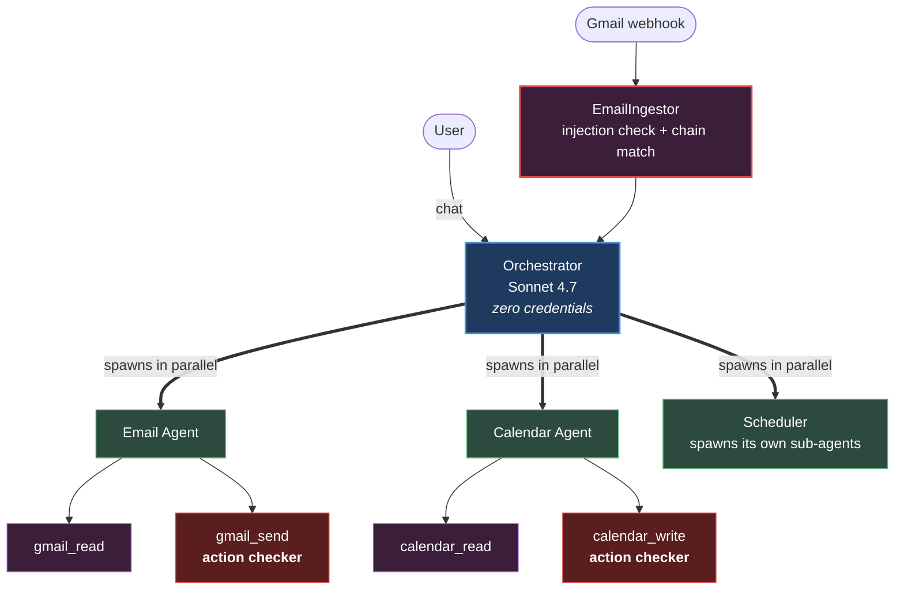
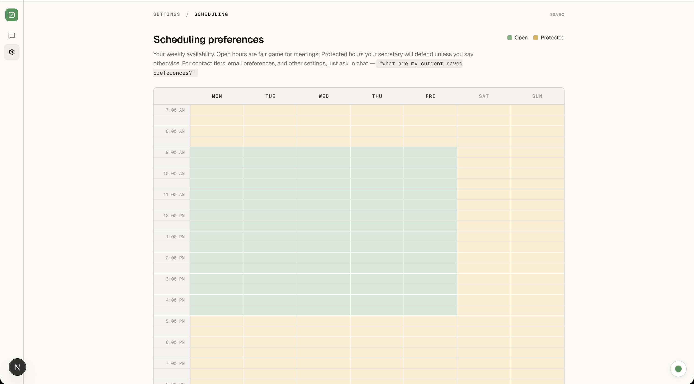
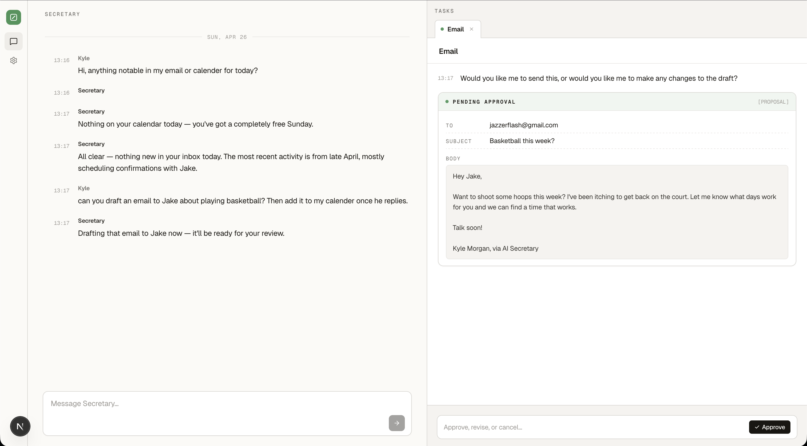
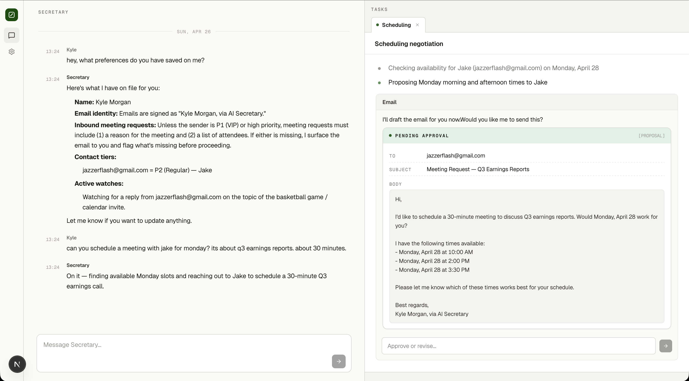
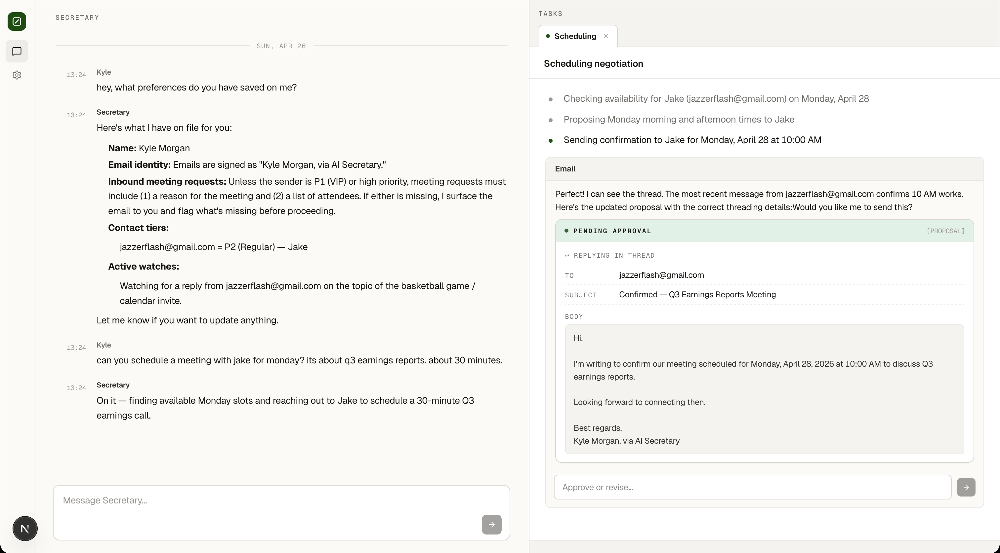
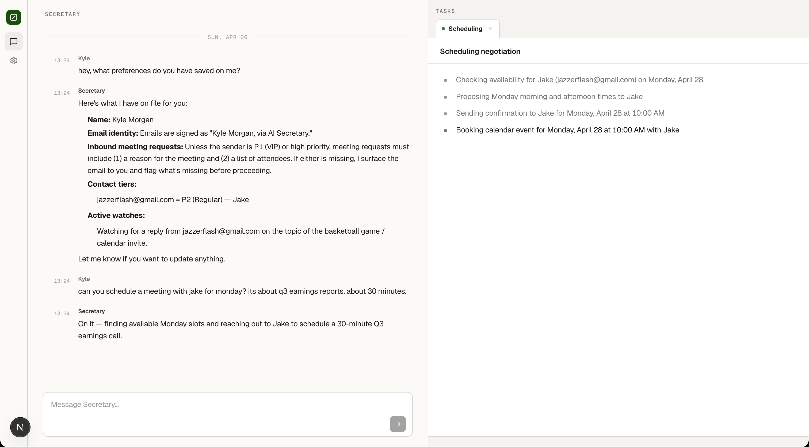

# secretary-agent

A personal AI secretary built to protect your time the way a real assistant would.

Most calendar tools are dumb schedulers. They treat your boss the same as a cold-outreach request, find a slot that's technically free, and book it. This one doesn't. It reads who's asking, what they want, what your week actually looks like, what you've said matters this week, what slots you've marked as protected, and what you've told it about your relationships. Then it decides, like a real secretary would, whether this meeting belongs on your calendar at all, where it fits, and how to respond.

The intelligence is the product. The infrastructure exists to make the intelligence work end-to-end across email, calendar, and multi-day negotiations.

**Live status:** Phase 1 milestone 7 complete. Phase 1 milestone 8 (research agent) in progress. Smoke-tested end to end with real Gmail and Google Calendar.

---

## What it does

Six workflows work end to end today:

- **Inbound scheduling.** Meeting requests arrive, get triaged by priority tier, run through an agenda gate, and propose calendar slots that respect buffer rules, focus blocks, and daily caps. The negotiation can span days. If a contact replies three days later, the agent wakes up, fetches the conversation history for context, and continues from where it left off.
- **Outbound scheduling.** The user asks for a meeting in chat, the system finds compliant slots, drafts outreach, monitors for replies across multi-day negotiations, handles counter-proposals, and books on confirmation.
- **Multi-day negotiation loops.** Long-lived scheduling agents survive server restarts, hold context across days while waiting on external parties, and handle counter-proposals through a state machine in PostgreSQL.
- **Email management.** Read, summarize, draft, revise, and send. The draft lives inside the agent's conversation as a `[PROPOSAL]` block. The user replies in plain text ("make it funnier") and the agent revises.
- **Calendar read and write.** Schedule queries, conflict detection, personal events, reschedules, and cancels.
- **Reschedules and cancels.** Surfaces inbound reschedule requests, drives outbound reschedules through the negotiation loop, sends cancellation notices.

---

## Architecture

_Summary view. Full deep-dive in [docs/architecture.md](./docs/architecture.md)._

The orchestrator runs on Sonnet 4.7 with zero direct tool access. Sub-agents run on Haiku 4.5, spawn in parallel, and own their loops end-to-end. Security checks fire at the tool boundary, not at the orchestrator.

---

## How it thinks about your time

Every scheduling decision the orchestrator makes happens with full awareness of:

- **Contact tier.** P1 (boss, board, key investors), P2 (key relationships), P3 (standard internal/team), P4 (cold outreach). Tiers are user-defined and mutable in chat. The tier doesn't trigger a fixed action. It informs the LLM's reasoning the same way it would inform a human assistant.
- **The user's weekly priorities.** Set every Monday in chat. A meeting that aligns with this week's stated goals gets a different decision than one that doesn't, even from the same sender.
- **The weekly schedule template.** A grid in the settings page where the user marks each 30-minute block as Open, Preferred (best slots, offered first), Focus (deep work), or Blocked. The labels aren't hard rules. They're how the user tells the system which time matters most, and the LLM weighs that against everything else when deciding where a meeting belongs.
- **The agenda gate.** If a request lacks a clear purpose, the system emails the requester asking for one before booking anything. Mutable per contact, per tier, or globally.
- **Calendar rules.** Things like 15-minute buffers between meetings, daily caps for external meetings, weekly free-time floors, working hours, and timezone-correct slot proposals. Defaults are sensible, but they're context for the LLM, not constraints it enforces. A high-priority meeting can override a buffer if the reasoning holds up, the same way a thoughtful assistant would make the call.
- **Soft conflicts.** Travel days, deadlines stored as commitments, weekly priorities that would make a meeting poorly timed. The system surfaces these instead of silently scheduling around them.

None of these are hardcoded rules the LLM has to follow. They're _context the LLM reasons with._ The orchestrator gets the full picture every time it makes a scheduling decision and produces a proposal that explains its reasoning. The user always sees the proposal before anything is booked.

Every behavior has a safe default and a memory override slot. The user changes anything by saying it in chat: "skip the agenda requirement for direct reports," "treat all @acme.com as P1," "block Friday afternoons from now on." No settings forms. No code changes. Just conversation.

---

## Security model

_Summary view. Full model in [docs/security-model.md](./docs/security-model.md)._

Two layers. Injection check at ingest, action check at the tool boundary.

The Injection Checker runs before any LLM in the system sees external email content. Its prompt is hardcoded so it can't be overridden by injected instructions. It treats the content as inert text to classify, never as conversational input.

The Action Checker is a pre-hook on every write tool (gmail_send, calendar_create, calendar_update, calendar_delete). It fires before execution, regardless of which agent triggered the call. The orchestrator itself has zero credentials, so a compromised orchestrator can plan but can't act.

---

## Screenshots

### When to meet — weekly grid in settings

The user's source-of-truth for time defense. Cells are tagged Open, Preferred, Focus, or Blocked. The orchestrator weighs these as context, not as hard constraints, when ranking slots for an incoming meeting.

### Two-column chat

Orchestrator conversation on the left. Parallel task cards on the right, updating as agents work.

### Full negotiation loop

A scheduling thread end to end. The user asks for a meeting. The Scheduler spawns sub-agents, drafts outreach, sends, monitors for the reply, and confirms. The conversation thread shows every step.

**Step 1: outreach drafted and sent.** The Scheduler picked candidate slots that respect the weekly grid above, drafted the outreach as a [PROPOSAL] in the conversation thread, and sent it after approval.

**Step 2: reply received, confirmation drafted.** When the recipient's reply hits Gmail, the EmailIngestor matches it to the existing chain and routes it directly to the Scheduler. The Scheduler reads the reply, drafts the confirmation, surfaces it for approval.

**Step 3: meeting on the calendar.** Confirmation sent. Calendar event created via the Action Checker on `calendar_write`. Thread closed.

---

## What didn't work the first time

v1 worked end-to-end but was over-hardcoded. Routing decisions, classification rules, lane assignments, who-spawns-who, all of it lived in Python conditionals. The LLM was boxed in. The breaking point was a specific bug: drafts lost on revision. A user would say "make it funnier," the email agent would revise, and the draft would disappear because the architecture forced retrieval through queues instead of letting the draft live in the agent's own conversation.

That bug was a symptom. The disease was that the orchestrator was a bottleneck, the routing was hardcoded, and the agents couldn't think.

I rebuilt the entire system as v2. Five architectural decisions changed:

|                            | v1                                                                                          | v2                                                                             |
| -------------------------- | ------------------------------------------------------------------------------------------- | ------------------------------------------------------------------------------ |
| **Routing**                | Hardcoded conditionals (`if event.type == "scheduling_request" → inbound_scheduling_agent`) | LLM orchestrator reasons from event payload + agent_state                      |
| **Agent communication**    | Mediated through orchestrator and main.py                                                   | Direct A2A. Orchestrator spawns agents, agents spawn sub-agents, no middleman  |
| **Draft state**            | Externally retrieved from session memory                                                    | Lives inside `self.messages`. The context window IS the draft store            |
| **Security checks**        | Embedded in the middleman pattern                                                           | Pre-hooks at the MCP tool boundary, regardless of caller                       |
| **Cross-agent visibility** | Orchestrator polled / interrupted agents to know status                                     | Shared `agent_state` table in PostgreSQL. Orchestrator reads, never interrupts |

The v1 repo is preserved as `secretary-agent-v1` for anyone who wants to see the architecture I replaced.

_Full reasoning, alternatives considered, and consequences in [ADR-0001](./docs/adr/0001-v1-to-v2-pivot.md)._

---

## Tested

- 200+ unit tests covering the queue, models, classifier, calendar rules, checkers, and memory layer
- 30+ end-to-end smoke tests against real Gmail and Google Calendar (live OAuth, real email delivery, real event creation)
- 15+ adversarial security tests against the Injection Checker (social engineering, base64-encoded instructions, role reassignment, output override, hidden Unicode)

The smoke test suite walks the full inbound and outbound scheduling loops, including page-refresh recovery, server restart recovery for long-lived agents, real email threading via In-Reply-To headers, and idempotency on duplicate webhook delivery.

---

## Stack

Python 3.12, FastAPI, async SQLAlchemy 2.0, PostgreSQL with pgvector, Redis, FastMCP, Anthropic API (Sonnet 4.7 + Haiku 4.5), Next.js, TypeScript, Tailwind, Server-Sent Events for streaming, Docker Compose for local dev.

---

## Documents

- [Architecture overview](./docs/architecture.md). Condensed deep-dive on the v2 architecture
- [Security model](./docs/security-model.md). Three Laws, injection defense, tool-layer checks
- [ADR 0001. The v1 to v2 pivot](./docs/adr/0001-v1-to-v2-pivot.md). Full reasoning behind the rebuild

---

## License

MIT. See [LICENSE](./LICENSE).

---

## Contact

Kyle Morgan · [kyle-morgan.me](https://kyle-morgan.me) · [LinkedIn](https://www.linkedin.com/in/kyle-morgan0/) · kyle@themorganization.com
